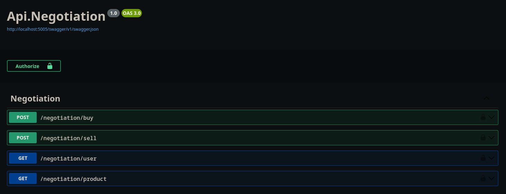
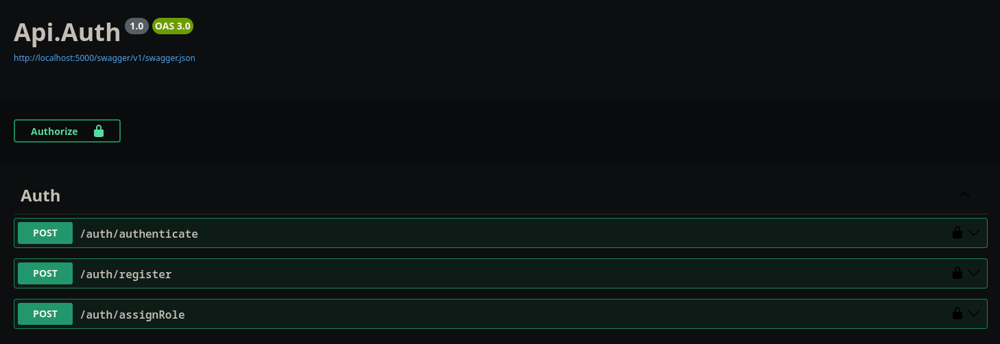
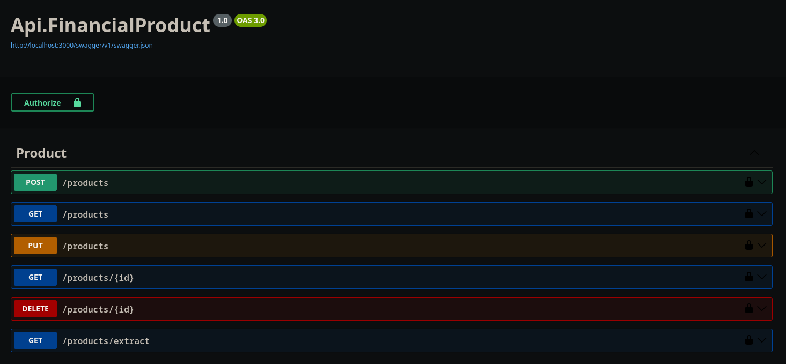
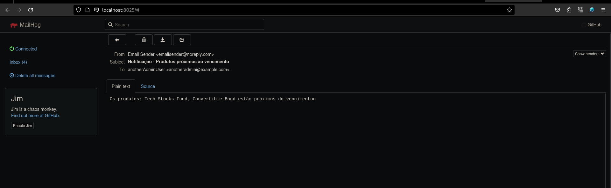

<p align="center">
  

  
  
  <a href="https://github.com/GabrielBueno200/InvestmentManager">
    
  </a>
  
   
</p>

<!-- PROJECT LOGO -->
<p align="center">
  
  
  
  
  
</p>
</p>

<!-- TABLE OF CONTENTS -->
<details open="open">
  <summary>Tabela de conteúdos</summary>
  <ol>
    <li>
      <a href="#-about-the-project">Sobre o projeto</a>
    </li>
    <li>
      <a href="#-how-to-run">Como rodar</a>
    </li>
  </ol>
</details>


## 💻 Sobre o projeto
O projeto se propõe a ser um sistema de gestão de portfólio de investimentos para uma empresa de consultoria financeira, permitindo que os usuários gerenciem os investimentos e comprem, vendam e acompanhem investimentos.

### Abordagens exploradas
Para garantir que consultas de produtos disponíveis e extratos mantenham um tempo de resposta abaixo de 100ms, foram usados recursos como `load balancer` para distribuir a carga entre instâncias e evitar sobrecarga, cache distribuído para acelerar o acesso a dados frequentes e bancos de dados não relacionais com índices e paginação baseada em cursor para otimizar consultas e escalar eficientemente.

## 🚀 Como rodar

### Requisitos Mínimos
Para a execução do sistema é necessário que o `Docker` e `docker-compose` estejam instalados.

Existem duas formas de executar o sistema: a primeira localmente, executando todos os microsserviços via IDE ou linha de comando; e a segunda via `Docker`, executando todos os containeres. 


### 1 - Executar Localmente

### 1.1 - Executar containeres 

Para executar o projeto localmente será necessário executar ao menos os containeres referentes à base de dados, ao cache distribuído e ao simulador de servidor Smtp. Esses containeres estão especificados no arquivo `docker-compose.yml`. São eles: `mongo`, `redis`, `mailhog`.

```bash
sudo docker compose up -d mongo redis mailhog
```

### 1.2 - Compilar e executar os projetos

- Visual Studio / Visual Studio Code / Outras IDEs ou editores:
  - Caso prefira executar via IDE ou editor, primeiro será necessário abrir a solution "InvestmentManager.sln"
  - Após isso, basta executar cada projeto de microsserviço contido na pasta `src/Service`

- Linha de comando
  - Da mesma forma, será necessário executar todos os microsserviços.
    ```bash
    cd src/Services/Auth/Api.Auth
    dotnet run build

    # Realizar o mesmo procedimento para os outros microsserviços
    ```

### 2. Executar via Docker

Para executar o projeto via `Docker`, basta rodar o comando `up` do `docker compose`. Todos os containeres necessários serão executados.

```bash
sudo docker compose up -d
```

## 💻 Como utilizar

###  1 - Swagger

Para executar cada endpoint o `Swagger` foi mantido nos containeres `Docker`, basta acessá-los via navegador. Também há a possibilidade de usar outras ferramentas de preferência para fazer as requisições.





###  2 - Autenticação

Todos os microsserviços implementados requerem autenticação, então antes de executar qualquer endpoint será necessário autenticar-se por meio do microsserviço `Api.Auth`, consumindo a rota `auth/authenticate`. Nesse mesmo microsserviço existem também rotas para poder cadastrar um usuário e também de associação de roles (que são Admin, Operation, Customer).

###  3 - Produtos e Investimentos

Para visualizar o extrato de um produto será necessário consumir a rota `/products/extract` do microsserviço `Api.FinancialProduct`. Vale ressaltar que para que sejam exibidos os investimentos associados ao produto será necessário que antes tenha sido feito algum investimento (compra ou venda) por meio das rotas `/negotiation/buy` e `/negotiation/sell`, pertencentes ao microsserviço `Api.Negotiation`.

- No microsserviço `Api.FinancialProduct` foram implementados métodos de `CRUD` para os produtos financeiros, cada um com os seus respectivos privilégios de autorização. Devido à alta volumetria de dados especificada no case, também foi implementado `load balancer` e `proxy reverso` com `nginx` para esse serviço (veja `/scripts/nginx.conf`), balanceando a carga em três instâncias, conforme especificado no `docker-compose`. Além disso, também foi utilizado cache distribuído para as instâncias balanceadas utilizando `Redis`.

- No microsserviço `Api.Negotiation` foram implementados métodos de negociação, ou seja, de compra e venda, conforme dito anteriormente. Além disso, também existe uma rota para retornar os investimentos do usuário logado: `/negotiation/user`

### 4 - Envio de e-mail

Para o envio dos emails, o job `SendEmailNotificationJob`, desenvolvido em `Quartz.Net` e contido no microsserviço `Notification`, é executado diariamente ao meio-dia, conforme a expressão cron `0 0 12 * * ?`. São enviados e-mails para usuários administradores de produtos que estejam com a data de vencimento de hoje até a próxima semana. Também foi utilizado o simulador de servidor Smtp `MailHog`, podendo visualizar os envios de e-mails trafegados na sua interface gráfica (`localhost:8025`):




### 5 - Seed da base de dados

O seed da base de dados foi configurado num volume `Docker`, apontando para o arquivo `/scripts/initdb/init-mongo.js`.
